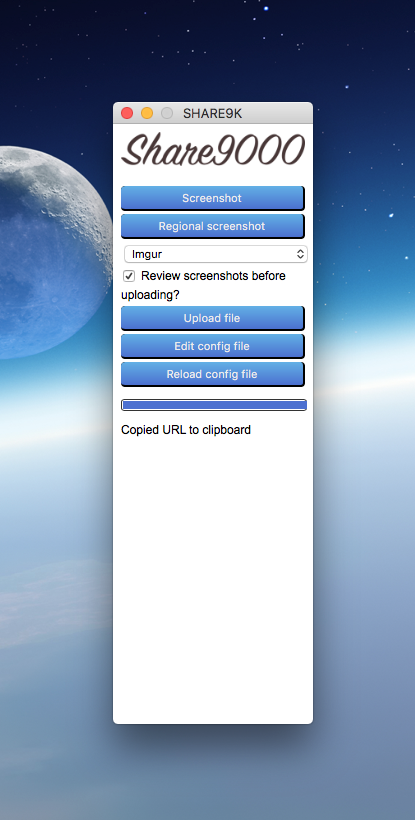

SHARE9K is a nifty little desktop utility for encrypted filesharing. 

It can grab a screenshot of your whole desktop, or a small region of it.

SHARE9K can be configured to do so based on a certain combination of keys, and it will put the upload URL in your clipboard.
